# 🏥 MedTrust – Doctor & Patient Management App

MedTrust is an Android application designed to streamline interaction between **doctors and patients**.  
The app provides separate workflows for doctors and patients, secure authentication, appointment and payment handling, and a clean Material UI experience.

---

## 📱 About the App

MedTrust aims to simplify healthcare management by providing:
- Dedicated **Doctor** and **Patient** modules
- Secure login and role-based navigation
- Patient consultation and video-call handling
- Online payment integration using **Razorpay**
- **Real-time doctor–patient video consultation using Zego SDK**
- Smooth and modern UI built with Material Design

The app is built with scalability and maintainability in mind, following modern Android development best practices.

---

## 🛠 Tech Stack

### Language & Core
- Kotlin
- Android SDK

### Architecture
- MVVM (Model–View–ViewModel)
- Clean Architecture principles

### UI
- XML Layouts
- Material Components
- ViewBinding

### Dependency Injection
- Hilt

### Navigation
- Jetpack Navigation Component

### Data & Storage
- Room Database
- SharedPreferences

### Payments
- Razorpay Payment Gateway

### Video Calling
- Zego SDK (Doctor–Patient video consultation)

### Other
- Android Jetpack Libraries
- Lifecycle Components

---
## 🔐 Authentication Screens

| Login | Register |
|-------|-------|
| 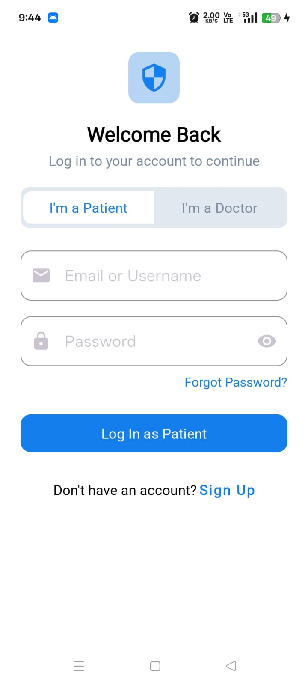 | 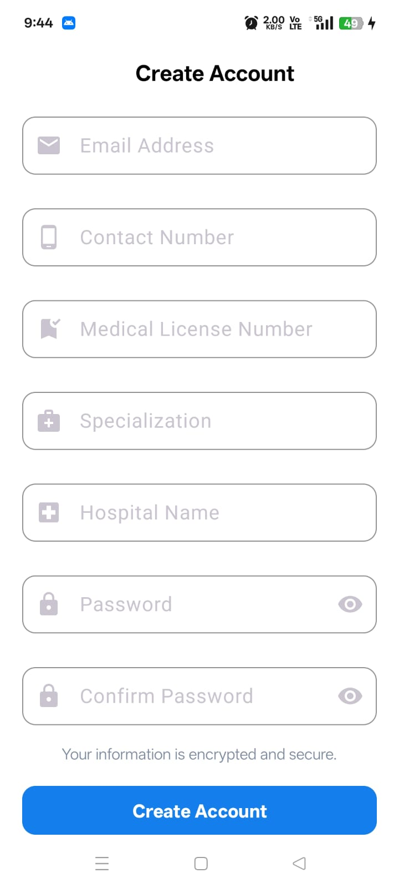 |


## 👨‍⚕️ Doctor Screenshots

| Home | Appointments | AppointmentDetail | History | Prescription |
|---------|---------|---------|---------|---------|
| 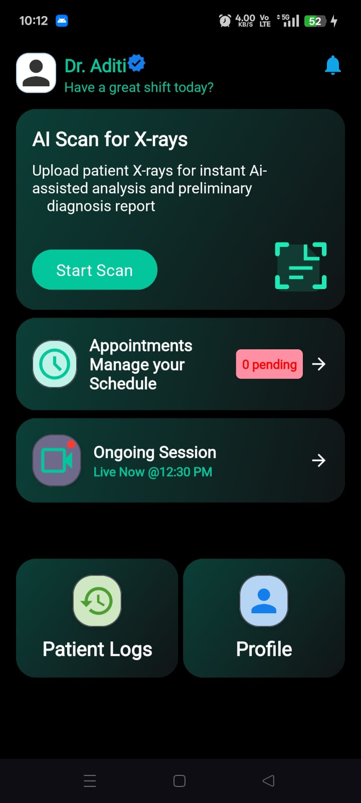 | 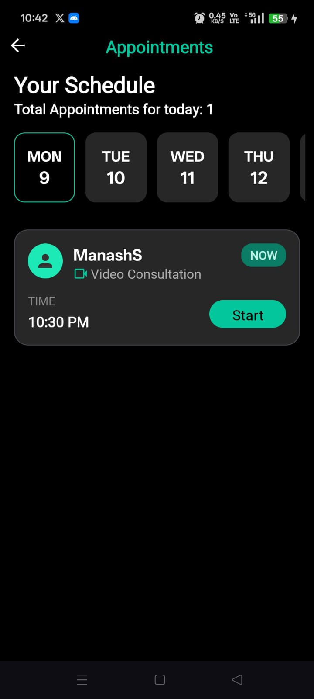 | 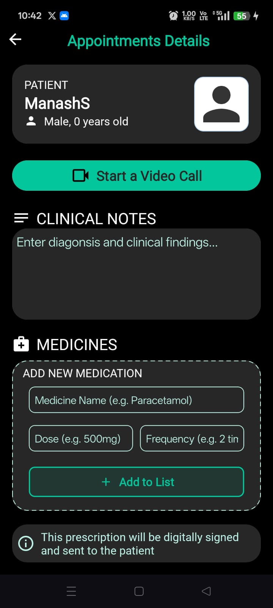 | 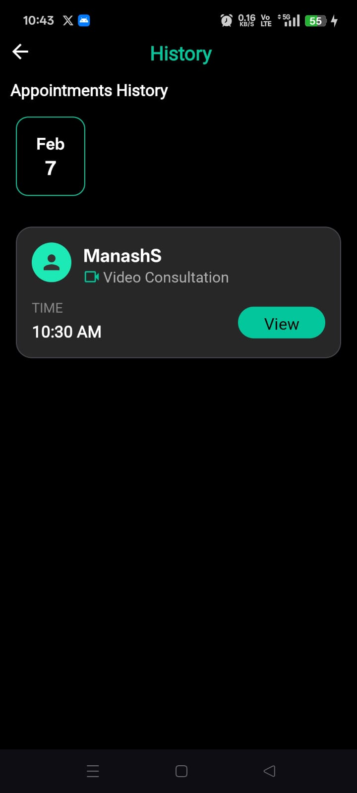 | 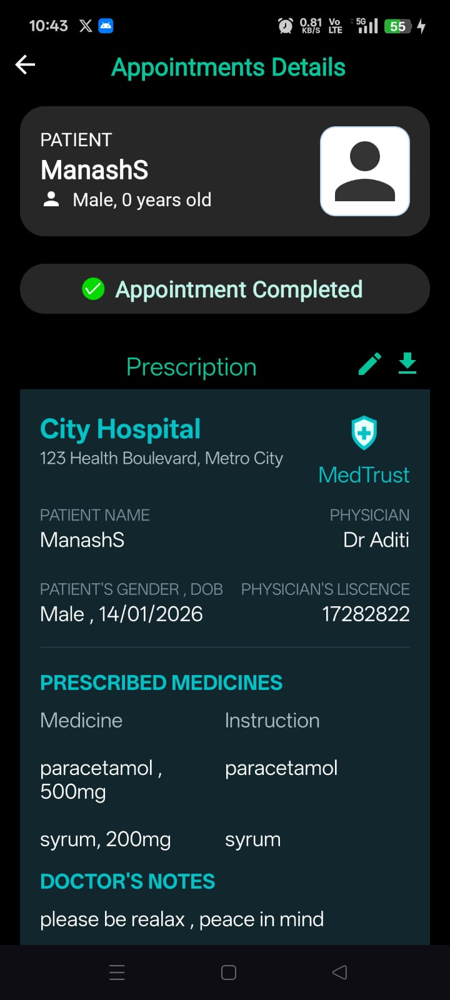 |


---

## 🧑‍🦱 Patient Screenshots

| Home | DoctorList | DoctorDetail & Booking | Appointments | Appointment Detail | Payment |
|---------|---------|---------|---------|---------|---------|
| 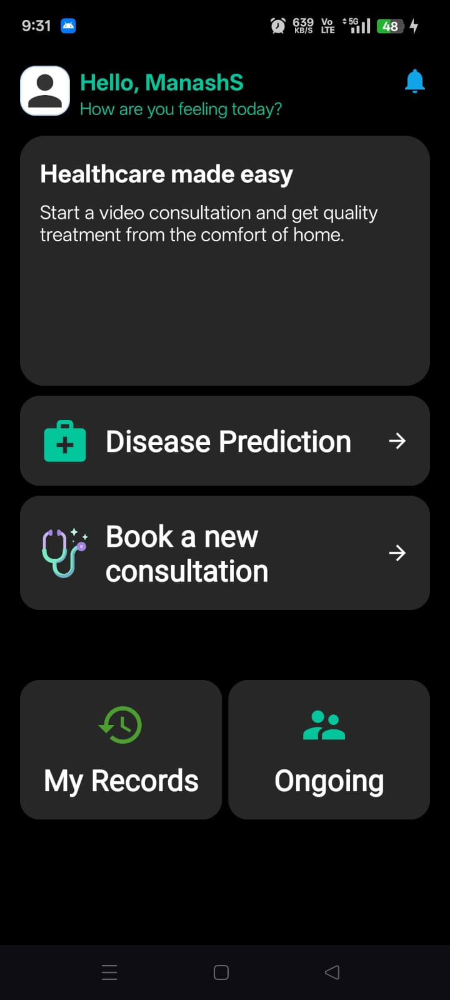 | 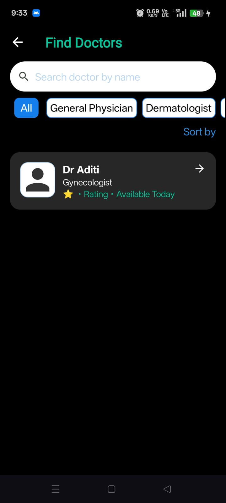 | 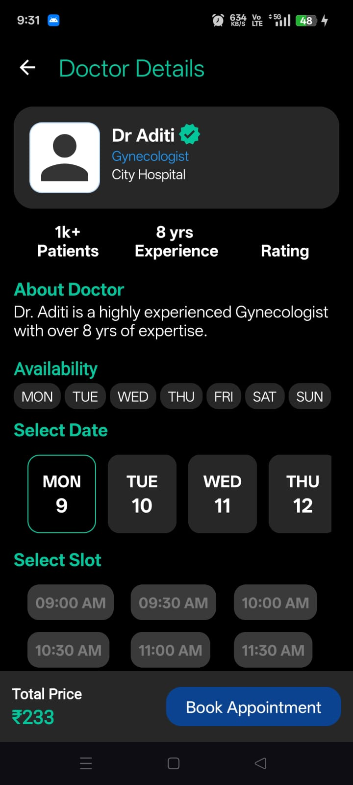 | 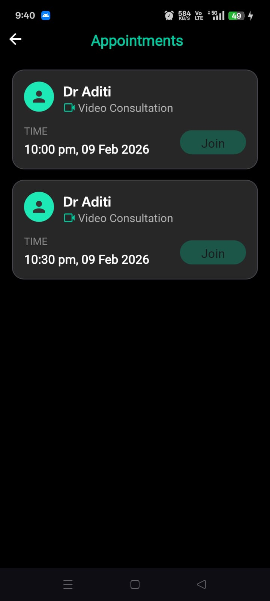 | 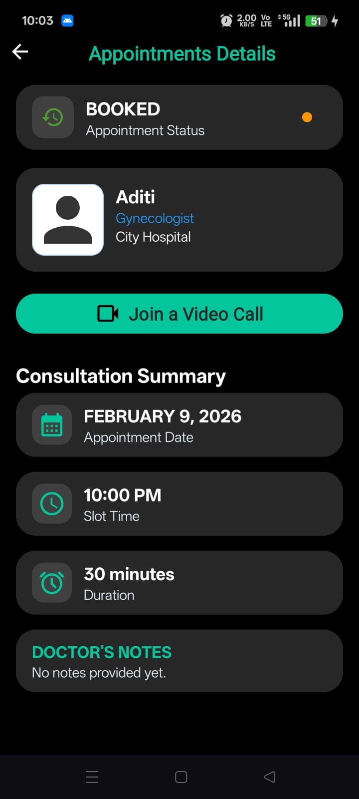 | 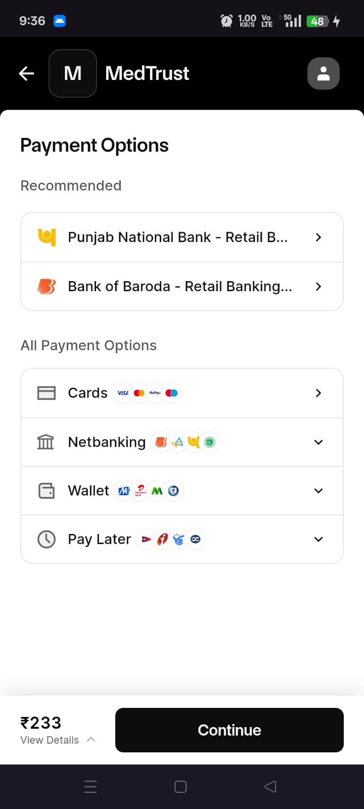 |


---

## 🎥 Video Demo

👉 **Watch here:**  
https://your-video-link-here  

---

## 🚀 Project Setup (Git Commands)

### 1️⃣ Clone the repository
```bash
git clone https://github.com/Manash396/MedTrust.git
